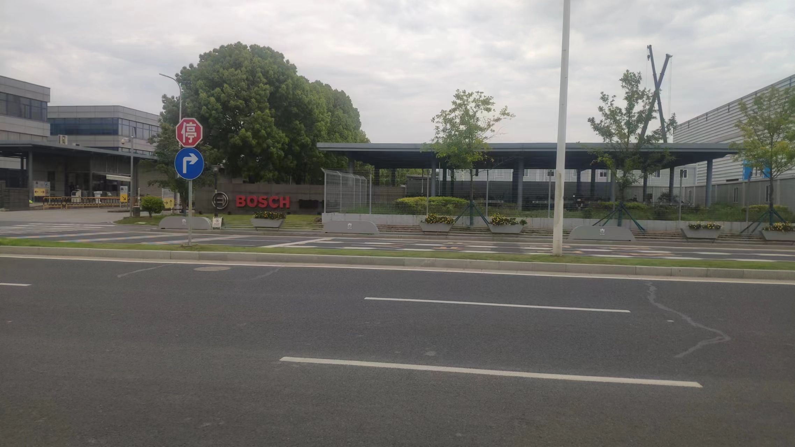
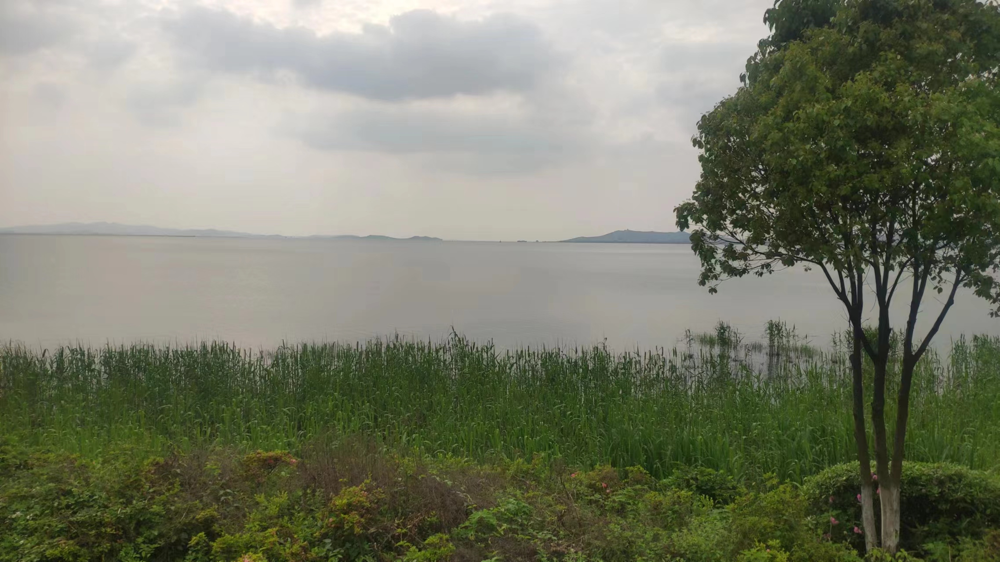
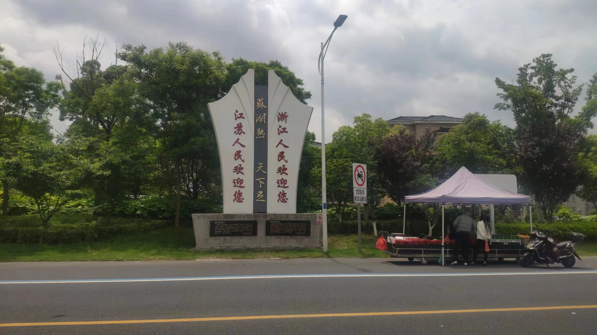
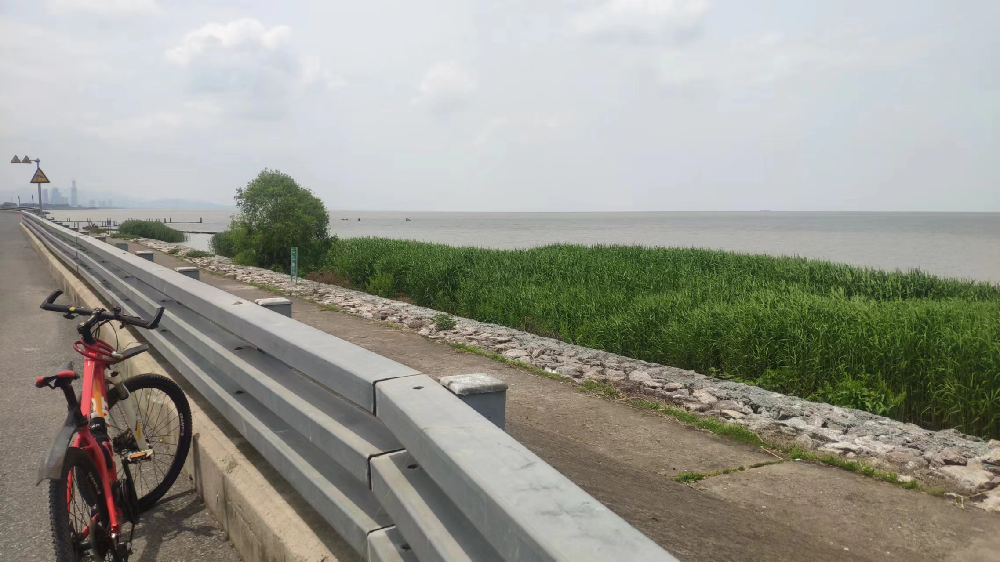
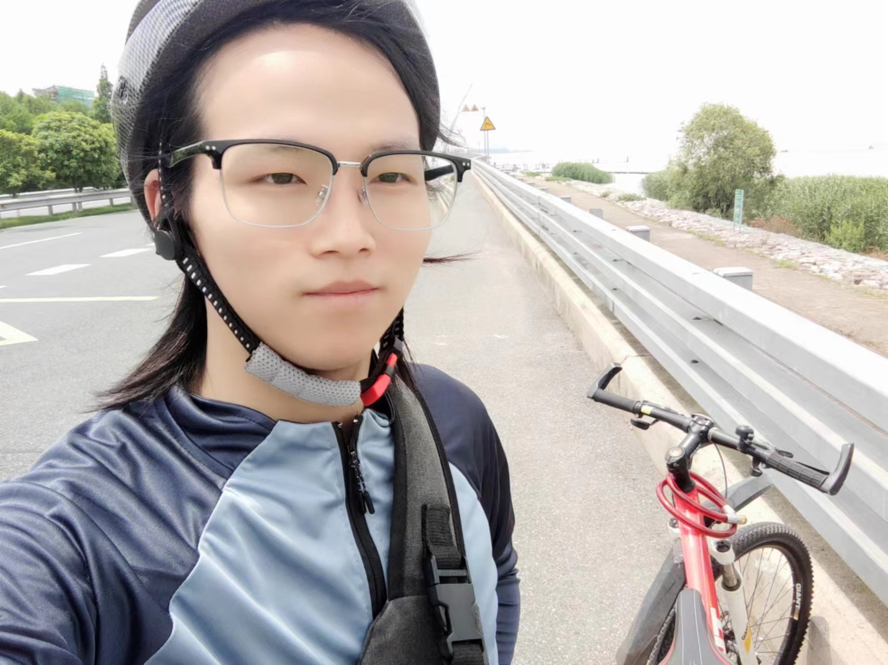
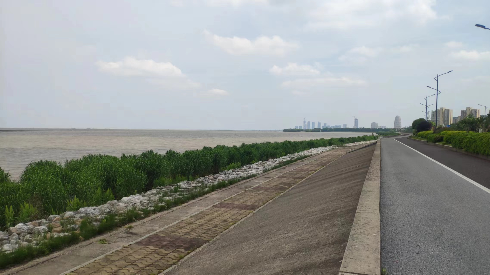
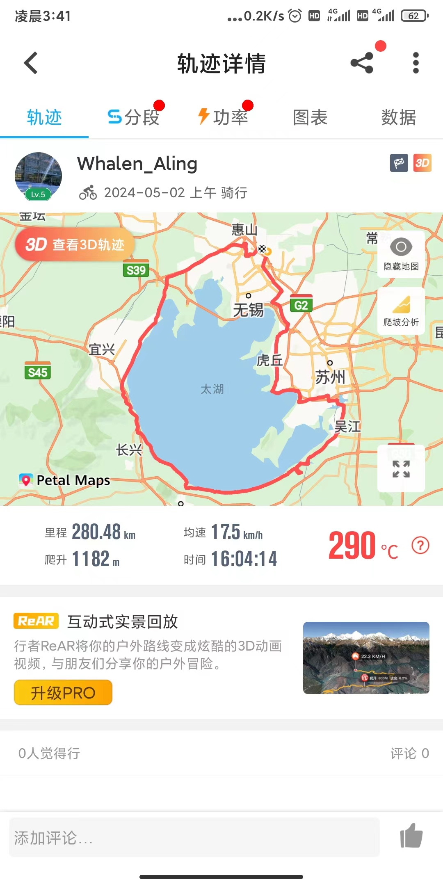

在五一假期这几天，我独自完成了280公里近乎环太湖的骑行壮举，请允许我用稍显夸张的“壮举”一次来形容这段经历。毫不掩饰地说，在我还算平静的生活里，我在做这个决定之前，还没有一次那么值得纪念的人生轶事。恰逢我刚好拥有一辆不算坏的二手山地自行车，临时起意的，我买了头盔，买了水杯和水杯架，又买了骑行服装(服装是5月1号到的，本来打算当天出发，但嫌骑行服闻起来气味难以形容，洗了洗顺便就把出行时间推到了2号)，趁着天气还算好的时候就出发了。

***
# 有什么意义呢？
有个屁的意义！
读一本书的时候，我很乐意思考一则故事或者一段话 里面有什么意义，就像试图把别人的作品，通过自己的想法占为己有。我认为很有道理，也很愿意这么做，这样 会使我乐在其中。
但根据现实的情况来看，我做某件事的时候，很容易被**质问**这样做的意义是什么，仿佛我不说出个令其信服的借口，我就做这件事的动机完全处于无理取闹，这件事情完全实在浪费生命一样。面对这样的提问，我一度语塞，然后被一种侵略性的眼光从头扫到尾。在不对等的价值观跟前，我浪费生命的可耻行为令我无地自容。

# 本就是没有意义的自我感动！
住在农村的朋友可能经历过，小时候不好好念书，大人常见的做法是，把你拧到田里，和大人一起插秧播种、收油菜收谷…… 然后还要在你忙完一天的活之后，借机问你：“读书好还是干活好？” 无论被问多少次，都会给出家长满意的回答“读书好”。然后家长会心地说：“好好学习，将来你就不会种田了！” 
看吧，这就是大人眼中，你小时候经历的那些劳动的意义：把你送到田地里，为了帮家里干活是次要的，主要是让你悟出读书轻松干活苦的道理。
我相信读书可以使人改变命运。但那时的我，可能悟到的意义会有所不同：我即时没犯错，有好好念书，期末在那个学校的年级里面得了前几名，我也一样会在时令到了的时候，下到田地里帮忙干活。
我们的领导人说自己当知青时下乡插队，和农民打成一片，那时候的自己虽然辛苦，但是快乐的。我想我那时也是快乐的，在一个还算无忧无虑的年龄，的确不应该在干活的时候反复思考读书好还是干农活好。这种想法，只要有一个正确的对待方式，那就是有意义，就不值得像一个机器一样反复鞭策。
所以后来再有人问：这样做的意义是什么？
--有个屁的意义，锻炼身体罢了。

***
以下是这段经历中的一些照片：

`出发前一天，吃点好的`

`第一天，还在无锡，路过机场前，先路过这家梦想中想去的公司`

`大约是下午三点左右，由于不是直接抵达太湖，而是先到苏州，见到了苏州的太湖旁`

`此后是第二天在苏州的脚步很快，这里人很多，商业化严重，尴尬的地方是晚上找不到很有性价比的住宿，一晚上花了两百，第二天赶紧逃离这个略显失望的地方`

`这里是湖州，还没到主城区，但是这里露营的人特别多，湖岸线挤满了帐篷。也是在这里遇到了飙摩托的人出车祸，跟一辆箱型小货撞上了，不一会儿就来了一辆救护车`

`刚过湖州主城区，一回头还能看到，突然想到一路过来都没什么照片，赶紧拍个照，顺便说一句，这一段的湖边，水很臭`

`到宜兴了，这段路真烂，还爆胎了，遂叫了个货拉拉到10公里以外的自行车店补胎。半个多小时顺便吃了点东西。宜兴这段的国道还建有收费站，差点以为上高速了。(槽点真多)  回想起路过苏州的时候，上了一段高架桥的1/5，发现不对劲，立马退了下来`

`完成！`
